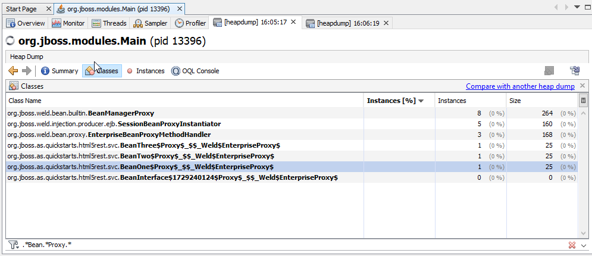

Intro

Shows the memory consumption of ```@Stateless``` EJBs when injecting beans via ```@Inject @Any Instance<T>```.

based on helloworld-html5: HTML5 and REST Hello World Example
Source: <https://github.com/jboss-developer/jboss-eap-quickstarts/>  


Steps to reproduce:

- build and deploy to a jboss eap 7.1
- run the following bash scrpit:

```bash
for i in {0..100}; do curl 'http://localhost:8080/helloworld-html5/hello/json/test' -X 'POST'; done
```


- open VisualVM and run GC
- Perform a threaddump
- search for classes with regex pattern: ```.*Bean.*Proxy.*```


After first invocation, things look like this:




After running the above bash snippet with 100 invocations, things look like this:


